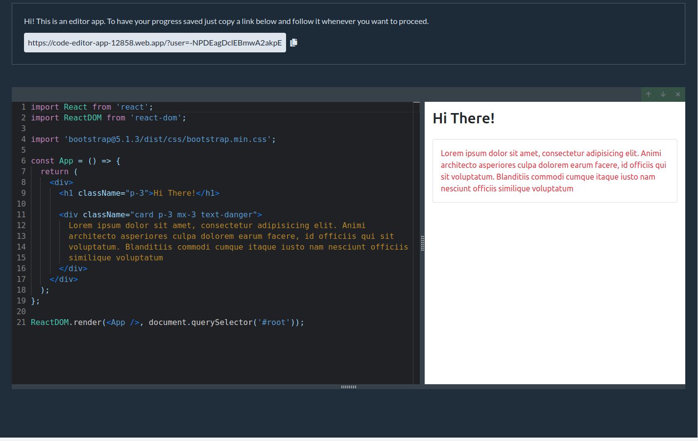

# code-editor

An app that enables a user to write and bundle code directly in a browser. Used the following stack: Typescript, React, Redux, HTML, CSS.

Deployed on Firebase - https://code-editor-app-12858.web.app/.

